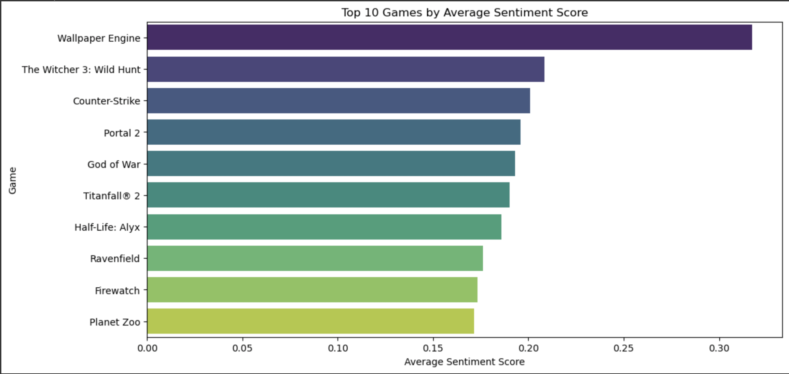
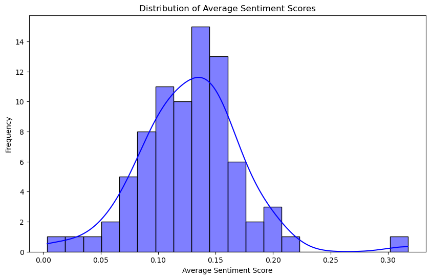
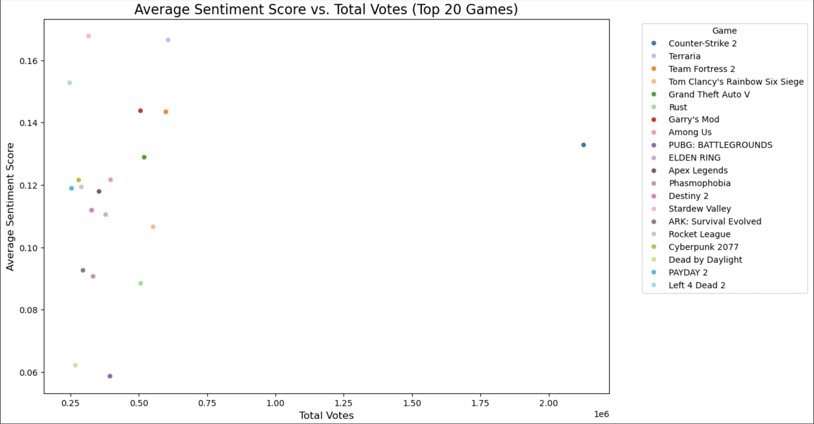
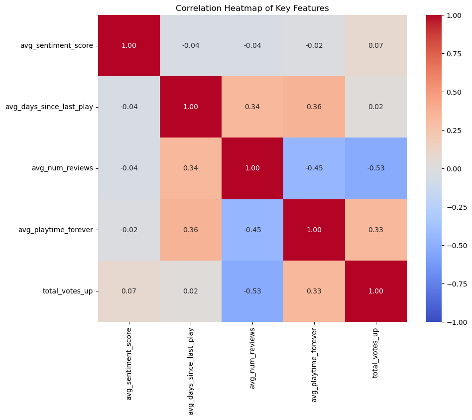
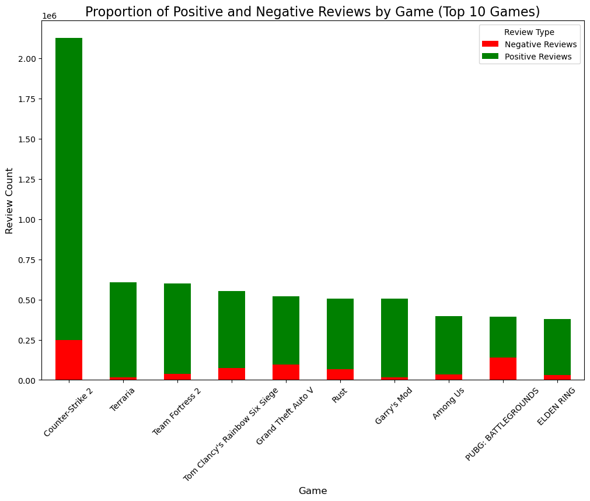
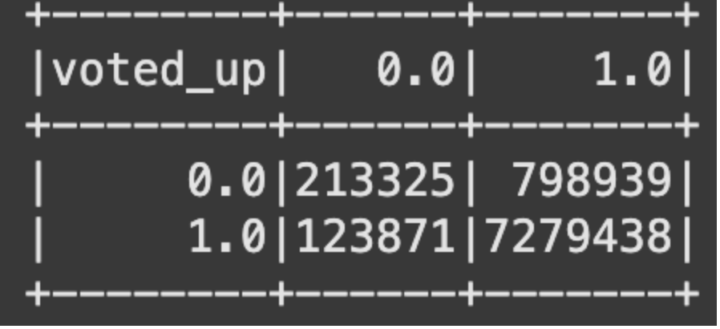
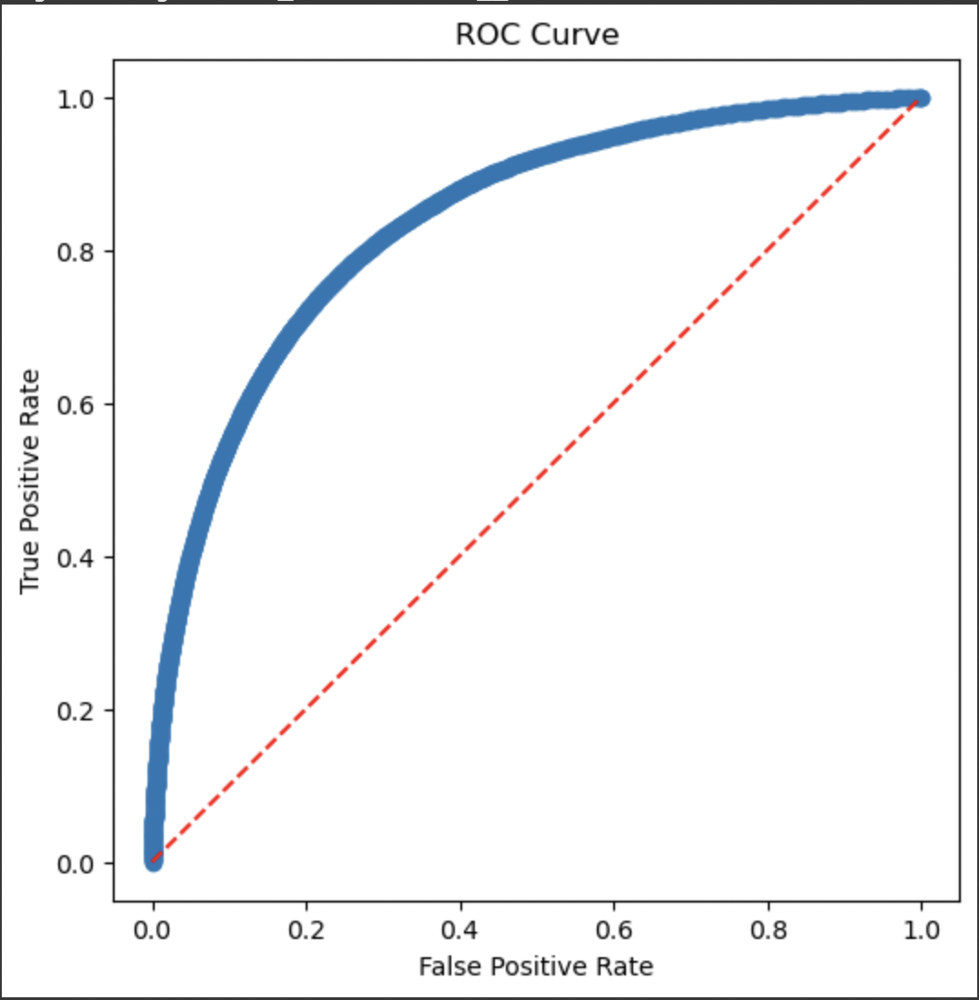
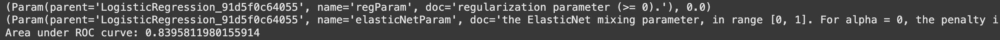

# Steam Reviews Logistic Regression Model

## Kaggle Dataset: [100+ Million Steam Reviews](https://www.kaggle.com/datasets/kieranpoc/steam-reviews)

### Introduction

The video game industry is constantly growing, releasing new and innovative games to keep its player base captivated and enticed. For instance, Steam, the renowned online platform for downloading all genres of video games, releases several thousands of games every year and concurrently has 34 million active users. Additionally, I have always had a strong interest in the gaming industry and have imagined that I would eventually be involved in the industry somehow. Therefore, I decided to use Kaggle’s “100 Million+ Steam Reviews” data set for my machine learning project, as I plan on building a logistics regression model that would predict whether or not a player’s review of a game was positive or negative based on several metrics. Some metrics include the app ID, recommendation ID, the name of the game being reviewed, the review author’s Steam ID, and the author’s lifetime amount of reviews written. However, the ones that will be particularly utilized and essential to the model will be the reviewer’s total playtime in the game, their playtime in the last two weeks, playtime as of when the review was written, the specific time stamps/date for when they last played, a score reflecting the players’ attitude towards the game based on the review itself, the number of votes the review got, and finally the predictor variable is whether or not the review was given a vote. 
	
Overall, using this data set for my ML project enables me to fulfill my interest and passion in a way, as my model would be able to assist game developers on Steam with predicting how their games are doing in their current state based on the invested time of their player base as well as the voiced opinions about their game forms said player base. Thus, providing useful information as to what they could do with their games to improve player reception and retention. 

### Data Acquisition
The first step to building the model was to extract the necessary data that I would eventually be working with and store it in my virtual machine. Through the Google Cloud platform, I was able to do this by initially using an instance to download the Kaggle data set into the virtual machine and not the one being used locally. Command lines that were used to execute this were:
  
- **mkdir kaggle** – to create a Kaggle directory
- **mv kaggle.json .kaggle/** – to move the downloaded & uploaded kaggle API token to the Kaggle directory
- **chmod 600 .kaggle/kaggle.json** – to secure the moved file

Moreover, a Python environment required being set up, as it would allow me to utilize some of Kaggle’s tools to download the data from Kaggle onto the virtual machine. Those additional command lines included:

- **sudo apt -y install python3-pip python3.11-venv** – to install python and the python virtual environment
- **python3 -m venv pythondev** – creating the virtual environment and calling it ‘pythondev’
- **cd pythondev** – to change to the python directory
- **source bin/activate** – activating the virtual environment
- **pip3 install kaggle** – installing the necessary kaggle tools
- **kaggle datasets download -d kieranpoc/steam-reviews** – downloading the kaggle dataset
- **sudo apt install zip** – installing the zip tool to unzip the downloaded contents
- **unzip  -1 steam-reviews.zip** – to show how many files are in the zip file to be unzipped
- **unzip steam-reviews.zip** — to unzip the downloaded dataset file

After the contents of the downloaded dataset file were unzipped, there were two CSV files present: all_reviews.csv and weighted_score_above_08.csv. However, the most relevant one was all_reviews.csv. Thus, the following command lines were needed to copy and upload the CSV file to a newly created Google Cloud bucket:
  
- **gcloud auth login** – to authorize using gcloud commands to the virtual machine
- **gcloud storage buckets create g://my-bigdata-project-bl –project=reviewed-steam-games –default-storage-class=STANDARD –location=uscentral1 –uniform-bucket-level-access** – to create the bucket for the file to be copied to
- **gcloud storage cp all_reviews/all_reviews.csv gs://my-bigdata-project-bl/landing/** – to copy/upload the CSV filed to a folder called ‘landing’ in the created bucket
- **gcloud storage ls -l gs://my-bigdata-project-bl/landing/all_reviews.csv** – to check if the file was successfully copied and specifically how much space it is taking up

### Exploratory Data Analysis

The next step forward in this project was to perform EDA or exploratory data analysis on the CSV file that was stored in the Google Cloud Service bucket. To do so, I utilized a GCS DataProc Cluster, as well as choosing to use PySpark to analyze the file I had stored in the landing folder within the bucket, as it was quite versatile for the size of the data. Through the process of analyzing the data, I came to witness firsthand that my data set had certain issues when parsing, as some values in the columns, which I had expected to be purely numeric values, had some misalignment with some text values that could have come from the review column itself. To combat this at the moment, I decided to purely filter out and work with only the English reviews while also filtering out any NULL values and any non-numeric data. However, a concern I might have in the future when performing feature engineering would be that even after filtering, there might still be some residual misalignment among the 51.5 million English reviews. Additionally, the graphs still pose a challenge, as they did not come out the way I intended or pictured, they are skewed very far to the left, and I can only make a histogram out of the first thousand or so reviews without the Kernel crashing even after increasing the memory of each node, as well as the amount of worker nodes. On the bright side, I was not only able to decipher the descriptive statistics for most if not all categorical values of my dataset but also filter out/clean the parts of the dataset that would not be relevant to the eventual logistics regression model that I will build and with some further tweaking, I am sure that I can get some more accurate visualization of how my data is distributed. 

### Feature Engineering and Modeling

Feature Engineering started with reading the cleaned parquet file from the cleaned folder of the GCP bucket that was saved during the EDA stage of the project. The features that were calculated and saved were the days since the reviewer last played the game (when the timestamp of the review was created divided by the author’s lifetime playtime) and the sentiment score using Pyspark’s built-in sentiment analysis library. Specifically for the sentiment score, the review text had to further be filtered and cleaned by expanding contractions and making sure no weird characters were counted as part of the review. When all the features were calculated, cleaned, and added to the original dataframe without any duplicates or null values, I was able to move on to creating the pipeline and assembling the features vector, all of which was saved into the final assembled dataframe.  
  
Once that was completed, implementing the final assembled dataframe with all the features and vectors into a logistic regression model was the next step. However, it proved to be a rather challenging and complicated transition due to the sheer content of the reviews themself as well as for the fact that the predictor variable contained abnormal values outside of what it was supposed to be (binary values). The dataproc cluster additionally struggled at times to run for the same reasons. Thus, there was some more code engineering that had to be done to account for those issues, and when all was done, everything proceeded smoothly.  For example, I was able to proceed to train/test the model as well as evaluate the model. Before cross-validation and optimizing the model, its accuracy (~11%), precision (~10%), recall (~79%), and f1-score (17.6%) which not only meant that the model identified most positive instances but also categorized many negatives as positives, but its overall predictive performance was quite poor. After cross-validating and optimizing the model further using CrossValidator, BinaryClassificationEvaluator, and ParamGridBuilder, the best model ended up correctly predicting positive reviews higher than negative reviews around 84% of the time. Finally, the best model was then saved to the models folder in the GCP bucket and is now automated and ready for deployment. 

### Visualizations

 

- This **bar plot** helps demonstrate the top 10 games by their average sentiment scores. The x-axis contains the average sentiment scores, while the y-axis has the name of the games. Although this only shows the top 10 games from a sample of the dataframe, it does highlight which games have the highest overall positive sentiment, which can help provide insight into games that are well-received by users, as well as encourage further study into the characteristics of the top games.

 

- This **histogram** displays the distribution of the average sentiment scores across the sampled games in the dataframe. The x-axis here is once again the average sentiment scores, while the y-axis has the frequencies of games within the range of the scores. Overall, this visualization helps convey how the sentiment for the games is distributed whether it be positive, neutral, or negative.

 

- This **scatterplot** shows the relationship between the average sentiment scores and the total votes for the top 20 games and whether or not there’s a correlation between user engagement and sentiment. Each dot represents a game, and the x-axis represents the total votes, while the y-axis is once again the average sentiment scores.

- The **heatmap** here shows the correlation between the key numeric features in the dataframe. In this instance, they were the average sentiment score, days since last played, number of reviews by the author, the lifetime playtime of the author, as well as the total votes. This could help with gaining insight into which features are strongly correlated with each other. For example, the average lifetime playtime is relatively correlated to the days since that last played the game. However, for the most part, it can be seen that the rest are rather negatively correlated, which could mean that there are other independent factors influencing the sentiment of the reviews.

- This **stacked bar plot** is useful for visualizing the proportion of positive and negative reviews for the top 10 games sampled from the dataframe. As made clear by the legend, the green bar represents the positive reviews, while the red represents the negative. The reviews for these games are positive overall, which means that these games are well-received by their players.

- This **confusion matrix** demonstrates how the logistics regression model predicted the ‘voted_up’ feature. With this, I can tell that the model has 7.2 million TPs (true positives) and 213.3 thousand TNs (true negatives), which are the numbers of positive and negative reviews the model predicted correctly, as well as 798.9 thousand FPs (false positives) and 123.8 thousand FN’s (false negatives), which represent the numbers positive and negative reviews that were incorrectly predicted. Knowing this information allows me to obtain metrics such as accuracy, f1-score, recall, precision, etc, which further provides valuable insights into the model’s performance. 

 

- The **ROC curve** displayed here suggests that the model performs well when it comes to distinguishing between positive and negative reviews. The red dotted line represents a random classifier, while the blue curve shows how the true positive rate varies with the false positive rate/ the trade-off between them. When combined with an AUC of approximately 0.83958, it means that if the model was given a positive and negative review, it would correctly predict or rank the review as positive higher than the negative around 83.96% of the time. Additionally, the grid search identified elasticNetParam and regParam (equalling 0 and 1 respectively) as the best parameters for the model. The elasticNetParam of 1 specifies pure L1 regularization, which typically encourages sparsity by shrinking some feature weights to zero. However, since regParam was 0, this meant that no regularization was actually applied, which indicates that the model performed best without any regularization, thus relying entirely on the data and features without penalizing the coefficients. Therefore, this suggests that the dataset and features were well-suited for logistic regression without overfitting concerns.
  
### Summary and Conclusions

In short, the logistic regression model based on the information and methods of evaluation seems to perform rather well after completing the data processing pipeline where all the features were fit into a features vector for the model to then be trained and tested, then optimized the model, and evaluated it using cross-validation. Admittedly, the steps building up to successfully having the model ready for deployment were rather inconvenient at times due to just how many complicating factors there were such as the number of reviews itself, the review text, the number of games being reviewed, and the language of the reviews, while also trying to manage NULLs, duplicates, and columns that needed to be converted or dropped to be something more easily processible. However, I am glad that there were ways to work around these issues and thus enabled me to fully move on to building the machine learning model for such a large dataset. Overall, this project has been very insightful, especially when it comes to the intricacies of cloud computing and the usage of a cloud platform like GCP to read and analyze large datasets using virtual machines.
	
As for the future steps ahead for putting the model’s capabilities to practical use for Steam game reviews, there is still a longer road ahead for further adjustments and optimization as well, since the model’s performance can be improved in terms of more accurately predicting negative reviews. Furthermore, I wonder if there could be a way to incorporate some kind of interactive UI for the model to be utilized. For example, I am confident that the model can be incorporated into a website or an interactive form that could ask for an input/review to be entered in by the user, and the model could then evaluate that new information and provide an output of whether or not that comment/review was positive or negative. 

